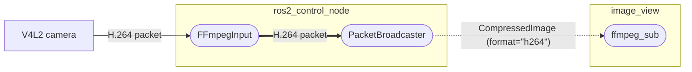
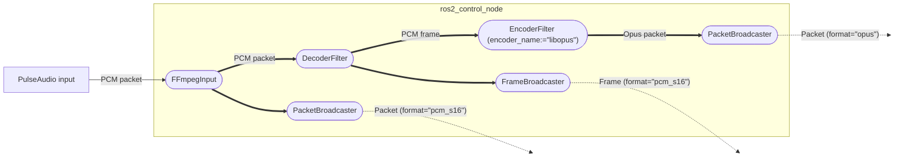

# ffmpeg_pipeline

A flexible pipeline for video/audio acquisition, encoding, decoding, and output using FFmpeg on ROS 2

## Overview

`ffmpeg_pipeline` is a collection of ROS 2 packages designed to efficiently and flexibly integrate the powerful and stable multimedia capabilities of FFmpeg into robotic systems. Using `ffmpeg_pipeline`, the following types of applications can be constructed solely through configuration files, without writing custom ROS 2 nodes:

* Read an H.264 stream from a USB camera on a robot and transmit it to the operator’s PC via a ROS 2 topic, without CPU-intensive re-encoding by the camera driver or `image_transport`. The operator PC decodes and displays the video with low latency using hardware acceleration.
* Read an audio stream from a microphone on the operator's PC, compress it using the high-quality Opus codec, and transmit it to the robot via a ROS 2 topic. The robot decodes it with low-latency settings and plays it through a speaker.
* Apply desired resolution/sample rate/format conversions to various input sources supported by FFmpeg (e.g., video/audio files, network cameras, desktop screens), compress them using the desired codec, and distribute them using the desired protocol.

To enable such flexible audio/video processing pipelines, `ffmpeg_pipeline` implements FFmpeg components—such as input, output, encoder, decoder, scaler, and resampler—as `ros2_control` hardware and controller plugins. This architecture provides users with the following benefits:

* Access to almost all FFmpeg functionalities using standard ROS 2 launch and parameter frameworks.
* Flexible composition of input/output and pre/post-processing (encoding/decoding/conversion) by combining desired hardware and controller plugins.
* Controllers are **chainable**, allowing complex pipelines with multiple processing stages to be built from modular, single-function controllers.
* Data is exchanged between hardware and controllers via pointers on `hardware_interface`, enabling efficient processing with minimal overhead.
* Transmitting processed data through ROS 2 topics enables seamless system integration across multiple processes or machines.


**Fig. example of distributed audio/video pipeline using `ffmpeg_pipeline`** 

## Packages

This repository contains the following packages:

* [`ffmpeg_controllers`](ffmpeg_controller): Chainable `ros2_control`-compatible controllers for encoding, decoding, and filtering audio/video streams.
* [`ffmpeg_cpp`](ffmpeg_cpp): C++ wrapper for the FFmpeg library.
* [`ffmpeg_hardware`](ffmpeg_hardware): `ros2_control`-compatible hardware drivers backed by FFmpeg input/output.
* [`ffmpeg_image_transport`](ffmpeg_image_transport): `image_transport` plugin powered by FFmpeg decoder for compressed images.
* [`ffmpeg_pipeline`](ffmpeg_pipeline): Core package for constructing FFmpeg-based pipelines.
* [`ffmpeg_pipeline_examples`](ffmpeg_pipeline_examples): Practical examples of various pipeline configurations.
* [`ffmpeg_pipeline_msgs`](ffmpeg_pipeline_msgs): Message definitions for transferring audio and video data.

## Verified Environments

ROS 2 Jazzy on Ubuntu 24.04 LTS

## Installation

```bash
mkdir -p ~/ros2_ws/src
cd ~/ros2_ws/src
git clone <this repository URL>
rosdep install --from-paths . --ignore-src --rosdistro jazzy -y
cd ~/ros2_ws
colcon build
source install/setup.bash
```

## Hardware Plugins

See [ffmpeg_hardware](ffmpeg_hardware) for details.

### Input Hardware

* **FFmpegInput**: Reads audio/video packets from various devices supported by `libavformat` and `libavdevice` (e.g., V4L2 or network cameras, PulseAudio inputs, local files, screen capture, etc.).

### Output Hardware

* **FFmpegOutput**: Writes audio/video packets and frames to various devices supported by `libavformat` and `libavdevice` (e.g., PulseAudio outputs, local files, etc.).

* **DumpInfoOutput**: Dumps packet and frame information from controllers for debugging and visualization.

## Controller Plugins

See [ffmpeg_controllers](ffmpeg_controller) for details.

### Filter Controllers

Filters retrieve data from hardware or other controllers and export processed results via their own state interfaces.

* **EncoderFilter**: Compresses frames into various formats using `libavcodec` (e.g., H.264, MJPEG, Opus, and over 100 other codecs).

* **DecoderFilter**: Decompresses packets in various formats using `libavcodec`.

* **VideoConverterFilter**: Converts resolutions and pixel formats using `libswscale`.

* **AudioConverterFilter**: Converts sample rates, channel layouts, and formats using `libswresample`.

* **AudioFifoFilter**: Adjusts the number of samples per audio frame using `libavutil`.

### Broadcaster Controllers

Broadcasters retrieve data from hardware or other controllers and publish it as ROS 2 messages.

* **PacketBroadcaster**: Publishes compressed audio/video packets.

* **FrameBroadcaster**: Publishes uncompressed audio/video frames.

* **ImageBroadcaster**: Publishes video frames as `sensor_msgs::msg::Image`.

* **CompressedImageBroadcaster**: Publishes video packets as `sensor_msgs::msg::CompressedImage`.

### Receiver Controllers

Receivers subscribe to ROS 2 messages and export them via their own state interfaces.

* **PacketReceiver**: Subscribes to compressed packets and injects them into the pipeline.

* **FrameReceiver**: Subscribes to uncompressed frames and injects them into the pipeline.

## `image_transport` Plugins

See [ffmpeg_image_transport](ffmpeg_image_transport) for details.

* **ffmpeg_sub**: Subscribes to `sensor_msgs::msg::CompressedImage` on the `~/image/ffmpeg` topic and decompresses messages using `libavcodec`.

## Running Examples

Below are examples of launching sample pipelines.

### Streaming H.264 Camera Video

```bash
ros2 launch ffmpeg_pipeline_examples h264_camera_pipeline.launch.py
```



### Audio Capture with PulseAudio

```bash
ros2 launch ffmpeg_pipeline_examples pulse_audio_capture_pipeline.launch.py
```

